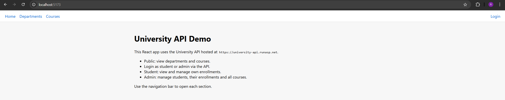
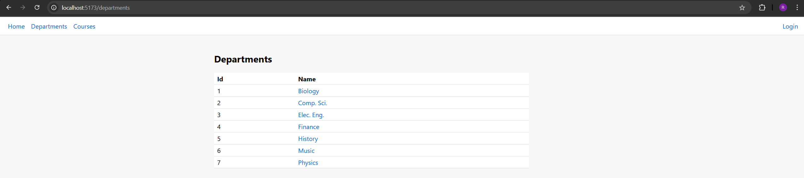
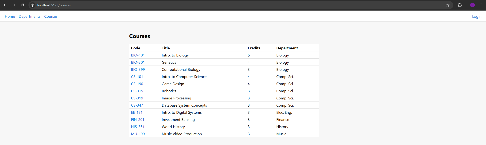
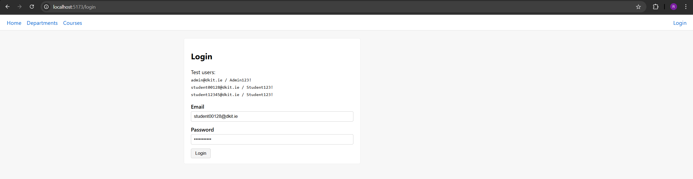
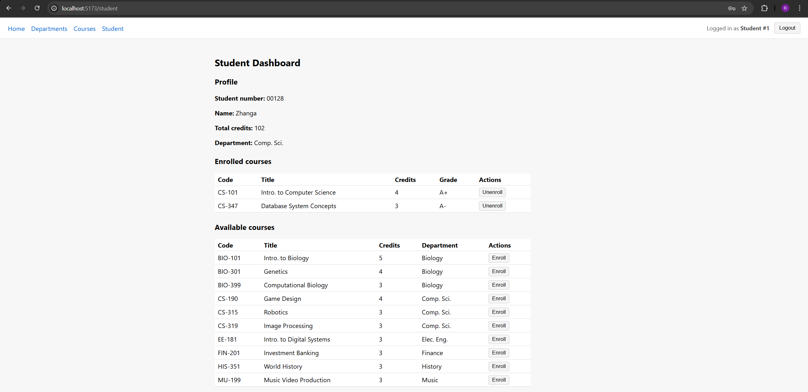
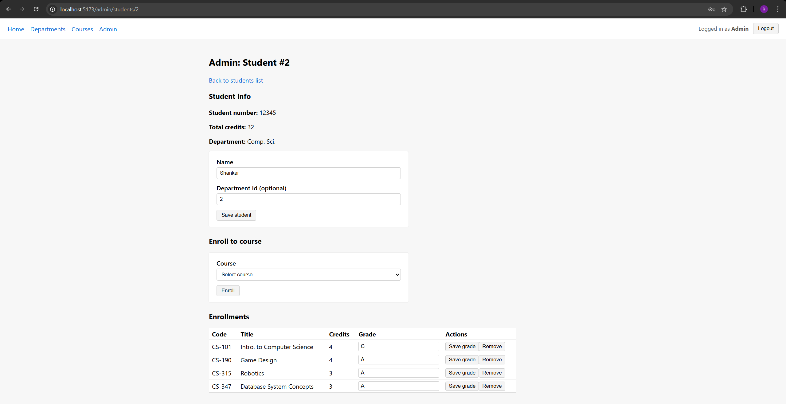

# university-web
https://roman-manzhelii.github.io/university-web

Simple React SPA that consumes the **UniversityAPI**.

The goal of this client is to **demonstrate that the backend works** and to provide a clear UI for:

1. Browsing public data (departments, courses)
2. Logging in as Admin / Student
3. Showing the student dashboard (own profile + courses)
4. Showing an admin view of all students

The client talks to the already deployed backend:

```text
API base URL: https://university-api.runasp.net
```







